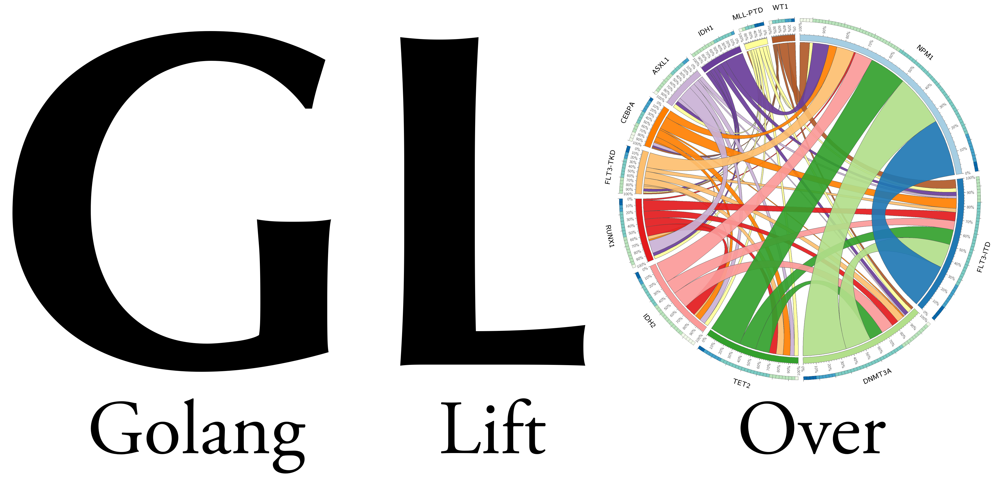

Go Language LiftOver (GLO) provides genomic coordinate conversion capabilities
in the manner of [UCSC's LiftOver tool](https://genome.ucsc.edu/cgi-bin/hgLiftOver). It allows for genomic coordinates
to be mapped between two reference genome assemblies by utilizing [Chain Files](https://genome.ucsc.edu/goldenpath/help/chain.html)
to determine the mapping between assemblies. 

# Installation
GLO does not have any external dependencies beyond Go core packages. To install
a copy locally, you can use *go get*, e.g.
```
go get github.com/blachlylab/GLO
```

# Use
To use the package, you must first import it into your Go program.
```go
import "github.com/blachlylab/GLO"
```

The liftover capabilities can then easily by utilized by first initializing 
the LiftOver struct that tracks the Chain File mappings between assemlbies,
then passing the struct requests as needed, e.g.
```go
// Initialize new struct instance
liftover := new(LiftOver)
liftover.Init()

// Load the hg19-to-hg38 chain file
liftover.LoadChainFile("hg19", "hg38", "hg19ToHg38.over.chain")

// Generate a ChainInterval struct that is used to pass in the request. The
// response will also be returned as a set of zero or more ChainIntervals.
target := ChainInterval{Contig: "chrX", Strt: 115149220, End: 115149335}
response := liftover.Lift("hg19", "hg38", &target)}

// The response variable will now contain zero or more ChainIntervals,
// depending on if the specified interval had no equivalent in the 
// target genome, had a unique overlap in the target genome, or was split
// between multiple regions in the target genome.
```
